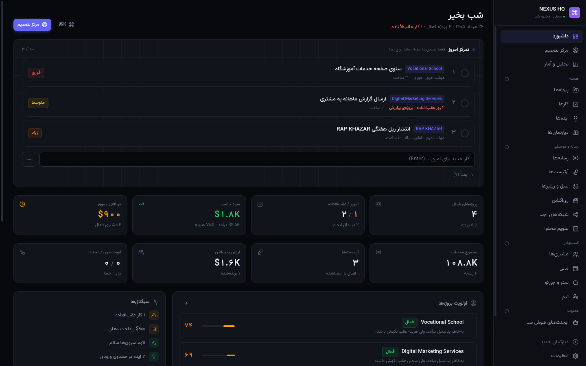
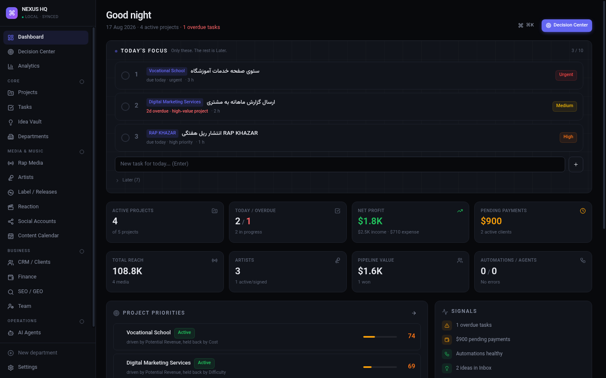
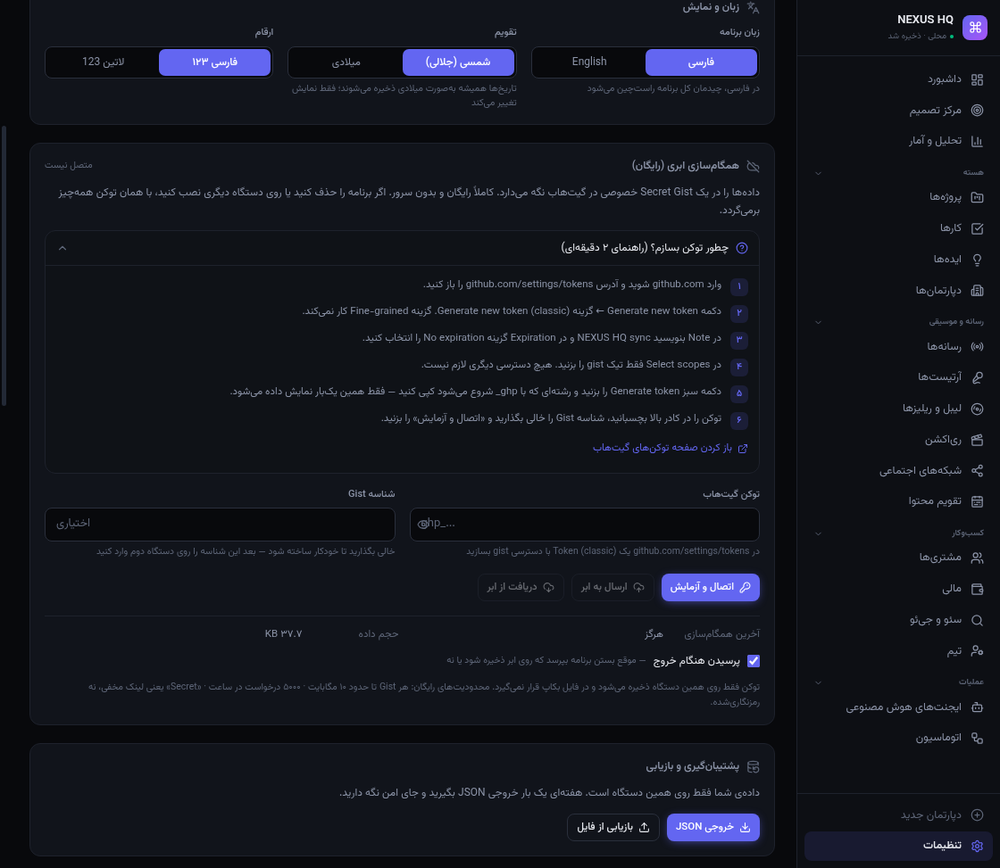

# NEXUS HQ — Personal Business Operating System

مرکز فرماندهی شخصی. Local-first، آفلاین، رایگان، بدون بک‌اند.
**دو نسخه از یک کد:** برنامه‌ی ویندوز (`.exe`) و نسخه‌ی مرورگر.
**دوزبانه:** فارسی (پیش‌فرض، کاملاً راست‌چین) و انگلیسی — با یک کلیک در تنظیمات عوض می‌شود.



> فلسفه: **FOCUS > COMPLEXITY** — این سیستم قرار نیست کار جدیدی به شما اضافه کند؛ قرار است بگوید **امروز روی چه چیزی کار کنید** و **چه چیزی را رها کنید**.

---

## 🪟 نسخه‌ی ویندوز (پیشنهادی)

دو فایل در پوشه‌ی `release/` ساخته می‌شود — **هر کدام را خواستید استفاده کنید، هر دو یکی هستند:**

| فایل | حجم | توضیح |
|---|---|---|
| `NEXUS-HQ-1.0.0-Setup.exe` | ~۹۵MB | **نصب‌کننده.** نصب می‌شود، شورتکات دسکتاپ و منوی استارت می‌سازد |
| `NEXUS-HQ-1.0.0-Portable.exe` | ~۹۵MB | **بدون نصب.** روی فلش هم اجرا می‌شود؛ دابل‌کلیک و تمام |

> در پوشه‌ی `release/` این مخزن فقط **Setup.exe** نگه داشته شده (محدودیت حجم فضای کاری).
> نسخه‌ی Portable را با `npm run dist:win:portable` یا از GitHub Actions بگیرید — هر دو از یک کد ساخته می‌شوند.
> درستی فایل: `release/SHA256.txt`

### نکته‌ی مهم هنگام اولین اجرا
چون این فایل **امضای دیجیتال** ندارد (گواهی امضا سالانه چند صد دلار است و قرارمان رایگان بود)، ویندوز یک هشدار آبی نشان می‌دهد:

> Windows protected your PC

روی **More info** بزنید و بعد **Run anyway**. فقط همان بار اول. برنامه هیچ اتصال اینترنتی ندارد و کل کدش همین‌جاست.

### ساخت دوباره‌ی exe از روی کد

```bash
npm install
npm run dist:win        # خروجی در release/
```

> ساخت exe روی خودِ ویندوز بدون هیچ ابزار اضافه‌ای کار می‌کند.
> اگر روی لینوکس build می‌گیرید، برای مرحله‌ی NSIS به `wine` (شامل `wine32`) نیاز دارید.

### ساخت exe بدون هیچ ابزاری روی کامپیوتر خودتان (رایگان)
اگر پروژه را روی گیت‌هاب گذاشته‌اید، گیت‌هاب می‌تواند روی یک **سرور واقعی ویندوز** برایتان build بگیرد:

**Actions → Build Windows App → Run workflow** — چند دقیقه بعد فایل exe آماده‌ی دانلود است.

برای ساخت یک نسخه‌ی رسمی با شماره‌ی نسخه:

```bash
git tag v1.0.0
git push --tags
```

فایل‌ها خودکار در بخش **Releases** ریپو قرار می‌گیرند. (ویندوز روی GitHub Actions برای ریپوی public رایگان است.)

---

## 📱 نسخه‌ی اندروید

| فایل | حجم | توضیح |
|---|---|---|
| `NEXUS-HQ-1.0.0.apk` | ~۳٫۵MB | **همان برنامه با تمام امکانات** روی گوشی — آفلاین |

راهنمای تصویری نصب: **[`docs/نصب-اندروید.html`](docs/نصب-اندروید.html)**

### نصب سریع

۱. فایل APK را به گوشی منتقل کنید (کابل USB، تلگرام، گوگل درایو).
۲. روی فایل بزنید ← اندروید اجازه می‌خواهد ← **«اجازه از این منبع»** را روشن کنید ← بازگشت.
۳. **نصب** را بزنید. اگر Play Protect هشدار داد: **«به‌هرحال نصب کن»**.

> هشدار Play Protect فقط به این معنی است که برنامه در گوگل‌پلی ثبت نشده — این برنامه‌ی شخصی خودتان است.

### انتقال داده از ویندوز به گوشی

روی ویندوز: تنظیمات ← همگام‌سازی ابری ← **ارسال به ابر** ← **کپی شناسه**.
روی گوشی: همان توکن + شناسه Gist را وارد کنید ← **دریافت از ابر**. تمام.

### تفاوت‌ها با نسخه‌ی ویندوز

| موضوع | نسخه‌ی گوشی |
|---|---|
| محل داده | حافظه‌ی داخلی گوشی (فضای خصوصی برنامه) |
| ذخیره هنگام خروج | دکمه‌ی **back** در صفحه‌ی اصلی همان سؤال «ذخیره در ابر؟» را می‌پرسد |
| ذخیره‌ی خودکار | هنگام کوچک‌کردن برنامه (`pause`) |
| خروجی بکاپ | فایل ساخته و برگه‌ی اشتراک‌گذاری باز می‌شود |
| منو | با دکمه‌ی ☰ بالای صفحه |
| میان‌برهای کیبورد | کاربرد ندارد — بقیه‌ی امکانات کامل است |

> با **حذف برنامه** داده‌های داخل گوشی پاک می‌شوند. قبلش «ارسال به ابر» بزنید.
> برای به‌روزرسانی، APK جدید را روی همان برنامه نصب کنید — داده‌ها می‌مانند (کلید امضا یکی است).

### ساخت دوباره‌ی APK از روی کد

```bash
npm install
npx cap sync android
cd android && ./gradlew assembleRelease
# خروجی: android/app/build/outputs/apk/release/app-release.apk
```

یا با اسکریپت آماده: `npm run android:apk`

نیازمندی‌ها: **JDK 17+** و **Android SDK** (پلتفرم ۳۵ + build-tools ۳۴ و ۳۵).
کلید امضا در `android/keystore/nexus-hq.jks` است و در `.gitignore` قرار دارد —
اگر گمش کنید دیگر نمی‌توانید نسخه‌ی جدید را روی نسخه‌ی نصب‌شده به‌روزرسانی کنید، پس یک نسخه‌ی پشتیبان از آن نگه دارید.

**مشخصات:** شناسه `app.nexushq.mobile` · حداقل اندروید ۶ (API 23) · هدف API 35 · دسترسی فقط اینترنت.

---

## اجرا در مرورگر (نسخه‌ی وب)

```bash
npm install
npm run dev      # http://localhost:5173
```

بیلد نسخه‌ی نهایی:

```bash
npm run build    # خروجی در dist/
npm run preview  # تست بیلد روی http://localhost:4173
```

اجرای برنامه‌ی دسکتاپ در حالت توسعه (hot reload):

```bash
npm run electron:dev
```

نیازمندی: فقط **Node.js 18+**. هیچ سرور، دیتابیس، اکانت یا کلید API لازم نیست.

### همه‌ی دستورها

| دستور | کار |
|---|---|
| `npm run dev` | نسخه‌ی وب، حالت توسعه |
| `npm run electron:dev` | نسخه‌ی دسکتاپ، حالت توسعه |
| `npm run build` | بیلد وب در `dist/` |
| `npm run dist:win` | ساخت `.exe` ویندوز در `release/` |
| `npm run smoke` | تست منطق (امتیازدهی، فوکوس، مالی، migration) |
| `npm run render` | تست رندر واقعی همه‌ی صفحه‌ها |
| `npm run lint` | بررسی کد |

---

## 🌐 زبان و راست‌چینی

| مورد | جزئیات |
|---|---|
| زبان پیش‌فرض | **فارسی** |
| زبان دوم | English |
| تعویض | Settings → **زبان و نمایش** → یک کلیک، بدون ری‌استارت |
| راست‌چینی | در فارسی **کل رابط** RTL می‌شود: سایدبار سمت راست، کانبان از راست، جدول‌ها، فرم‌ها، آیکون‌های جهت‌دار قرینه |
| قلم | **Vazirmatn** (OFL، رایگان) — داخل خود برنامه جاسازی شده، بدون نیاز به اینترنت |
| تقویم | **شمسی (جلالی)** یا میلادی — مستقل از زبان |
| ارقام | **۱۲۳ فارسی** یا 123 لاتین |



**نکته‌ی مهم درباره‌ی تاریخ:** تاریخ‌ها همیشه به‌صورت **میلادی ISO** ذخیره می‌شوند و فقط *نمایش* آن‌ها شمسی می‌شود.
یعنی داده هرگز قفلِ تقویم نمی‌شود؛ فایل بکاپ در هر دو حالت یکسان و قابل‌خواندن است.
تبدیل جلالی ↔ میلادی در بازه‌ی ۱۹۹۰–۲۰۴۵ (۲۰٬۴۵۴ روز) در برابر `Intl` تست شده: **صفر اختلاف**.

مقادیر داخلی (مثل `Doing`، `Urgent`، `Won`) همیشه انگلیسی ذخیره می‌شوند و فقط هنگام نمایش ترجمه می‌شوند — پس تعویض زبان هیچ‌وقت داده‌ی شما را دست نمی‌زند.

---

## ☁️ همگام‌سازی ابری رایگان (اختیاری)

پیش‌فرض **خاموش** است. هیچ داده‌ای بدون اجازه‌ی صریح شما جایی نمی‌رود.

**روش انتخاب‌شده: GitHub Secret Gist**

چرا این؟ چون تنها گزینه‌ای بود که همزمان: رایگانِ دائمی، بدون سرور، بدون کارت بانکی، بدون سقف زمانی، و مستقیماً از داخل برنامه قابل فراخوانی است (`api.github.com` هدر CORS باز دارد).

### راه‌اندازی (یک‌بار، ۲ دقیقه)

راهنمای تصویری کامل: **[docs/راهنمای-توکن-گیت-هاب.html](docs/%D8%B1%D8%A7%D9%87%D9%86%D9%85%D8%A7%DB%8C-%D8%AA%D9%88%DA%A9%D9%86-%DA%AF%DB%8C%D8%AA-%D9%87%D8%A7%D8%A8.html)**
همین راهنما داخل خود برنامه هم هست: **تنظیمات ← همگام‌سازی ابری ← «چطور توکن بسازم؟»**

| # | کار |
|---|---|
| ۱ | وارد `github.com` شوید و آدرس `github.com/settings/tokens` را باز کنید |
| ۲ | **Generate new token** ← **Generate new token (classic)** — گزینه‌ی *Fine-grained* کار **نمی‌کند** |
| ۳ | **Note** = `NEXUS HQ sync` · **Expiration** = `No expiration` |
| ۴ | در **Select scopes** فقط تیک **`gist`** — هیچ دسترسی دیگری، مخصوصاً `repo`، لازم نیست |
| ۵ | دکمه‌ی سبز **Generate token** ← رشته‌ی `ghp_...` را کپی کنید (**فقط یک‌بار نمایش داده می‌شود**) |
| ۶ | در برنامه: **تنظیمات ← همگام‌سازی ابری** ← توکن را بچسبانید ← شناسه‌ی Gist را خالی بگذارید ← **اتصال و آزمایش** |



### انتقال به دستگاه دوم / بعد از نصب مجدد
همان توکن + **شناسه‌ی Gist** (از تنظیمات دستگاه اول کپی کنید) را وارد کنید → **دریافت از ابر**.

### هنگام بستن برنامه
اگر همگام‌سازی روشن باشد، موقع خروج می‌پرسد:
**ذخیره و خروج** · **خروج بدون ذخیره** · **انصراف**.
اگر «ذخیره و خروج» را بزنید، داده اول روی دیسک و بعد روی Gist نوشته می‌شود و بعد برنامه بسته می‌شود.
این پرسش را می‌توانید از تنظیمات خاموش کنید.

### محدودیت‌ها (صادقانه)
| مورد | سقف رایگان |
|---|---|
| حجم هر Gist | ~۱۰ مگابایت (داده‌ی شما الان ~۴۰ کیلوبایت است) |
| تعداد درخواست | ۵۰۰۰ در ساعت |
| هزینه | **صفر · برای همیشه** |
| «Secret» یعنی چه؟ | لینکِ **مخفی و فهرست‌نشده** — نه رمزنگاری‌شده. هرکس لینک را داشته باشد می‌بیند. برای داده‌ی کاری شخصی کافی است؛ برای رمز عبور و اطلاعات بانکی **نه**. |

🔒 توکن شما **فقط روی همین دستگاه** در localStorage می‌ماند و **عمداً داخل فایل بکاپ قرار نمی‌گیرد**.

---

## 🗑 حذف‌شدنی بودن همه‌چیز

هیچ چیزی در این برنامه «قفل» نیست:

- **هر ماژول/دپارتمان** — چه پیش‌فرض چه ساخته‌ی خودتان — از Settings حذف می‌شود
- **همه‌ی داده‌ی نمونه** با یک دکمه پاک می‌شود (**پاک‌کردن همه‌ی داده‌ها**)
- داده‌ی نمونه فقط **یک‌بار** در اولین اجرا ساخته می‌شود؛ اگر پاکش کنید **دیگر برنمی‌گردد**
- ماژول پیش‌فرضی که حذف کرده‌اید هم برنمی‌گردد (در `removedCore` ثبت می‌شود)
- پشیمان شدید؟ **بازگرداندن ماژول‌های پیش‌فرض** آن‌ها را برمی‌گرداند بدون اینکه رکوردهای فعلی دست بخورند
- قبل از هر عملیات خطرناک یک **نقطه‌ی بازیابی خودکار** ساخته می‌شود

---

## داده‌ی شما کجاست؟

### در نسخه‌ی ویندوز (توصیه‌شده)

داده داخل یک **فایل JSON واقعی** روی دیسک شماست — نه داخل مرورگر:

```
C:\Users\<نام شما>\AppData\Roaming\NEXUS HQ\data\
├── nexus-hq.json          ← کل داده‌ی شما، یک فایل خوانا
└── snapshots\             ← ۲۰ نقطه‌ی بازیابی آخر
```

از داخل برنامه: **Settings → نسخه‌ی ویندوز → باز کردن پوشه**.

| مورد | جزئیات |
|---|---|
| محل ذخیره | فایل JSON روی دیسک |
| ارسال به اینترنت | **هیچ‌وقت.** حتی یک درخواست شبکه هم زده نمی‌شود |
| ذخیره‌ی خودکار | ۴۰۰ms بعد از هر تغییر + هنگام بستن برنامه |
| نقاط بازیابی | ۲۰ نسخه‌ی آخر روی دیسک |
| ایمنی نوشتن | atomic (فایل موقت + rename) — قطع برق فایل را خراب نمی‌کند |
| فایل خراب | پاک نمی‌شود؛ با نام `corrupt-<تاریخ>.json` کنار گذاشته می‌شود |

✅ پاک‌کردن کش مرورگر هیچ تأثیری روی داده‌ی نسخه‌ی ویندوز ندارد.
✅ حذف برنامه هم داده را پاک نمی‌کند (پوشه‌ی بالا دست‌نخورده می‌ماند).
💡 برای بکاپ کامل کافی است همان پوشه را کپی کنید یا در گوگل‌درایو بگذارید.

### در مرورگر

| مورد | جزئیات |
|---|---|
| محل ذخیره | **IndexedDB** مرورگر شما (fallback: LocalStorage) |
| ارسال به اینترنت | **هیچ‌وقت** |
| ذخیره‌ی خودکار | ۴۰۰ms بعد از هر تغییر + هنگام بستن تب |
| نقاط بازیابی | ۵ نسخه‌ی آخر (Settings) |
| بکاپ دستی | Settings → **خروجی JSON** |
| بازیابی | Settings → **بازیابی از فایل** |

⚠️ **مهم:** اگر کش/داده‌ی سایت مرورگر را پاک کنید، داده از بین می‌رود.
**هفته‌ای یک بار خروجی JSON بگیرید.** فایل را در گیت‌هاب، گوگل‌درایو یا فلش نگه دارید.
(در نسخه‌ی ویندوز این خطر وجود ندارد.)

⚠️ IndexedDB به **origin** وابسته است: داده‌ی `localhost:5173` با داده‌ی `username.github.io` یکی نیست.
اگر بین این دو جابه‌جا می‌شوید، با فایل JSON منتقل کنید.

### انتقال داده بین نسخه‌ی وب و ویندوز
در یکی **خروجی JSON** بگیرید، در دیگری **بازیابی از فایل**. فرمت داده در هر دو یکی است.

---

## ساختار

```
src/
├── domain/      # منطق خالص — بدون React (schema, scoring, focus, analytics, seed)
├── i18n/        # دیکشنری دوزبانه (dict) + برچسب‌های دامنه (domain) + هوک useT
├── lib/         # زیرساخت (db, migrate, backup, format, jalali, useFmt, cloud, desktop, id)
├── assets/fonts # Vazirmatn woff2 — جاسازی‌شده، آفلاین
├── store/       # Zustand — تک منبع حقیقت
├── components/
│   ├── ui/      # Primitives + Charts (SVG دست‌ساز، بدون کتابخانه)
│   ├── views/   # Table / Kanban / Cards / Calendar / RecordForm
│   └── layout/  # Sidebar / CommandPalette / ExitSavePrompt
└── pages/       # Dashboard / DecisionCenter / Analytics / Settings / ModulePage

electron/        # لایه‌ی نسخه‌ی ویندوز
├── main.cjs     # پنجره، منو، ذخیره‌سازی روی دیسک
├── preload.cjs  # پل امن بین برنامه و سیستم‌فایل
└── icons/       # آیکون برنامه
```

**Schema-Driven Module Engine:** هر ماژول فقط یک `ModuleDef` (JSON) است.
یک موتور مشترک از روی آن جدول، کانبان، کارت، تقویم، فرم، فیلتر، جستجو و Drag&Drop می‌سازد.
یعنی **دپارتمان جدید = کدنویسی صفر** → Settings → دپارتمان‌ها و ماژول‌ها.

جزئیات کامل معماری: [`ARCHITECTURE.md`](./ARCHITECTURE.md)

---

## میان‌برها

| کلید | کار |
|---|---|
| `⌘K` / `Ctrl+K` | Command Palette — پرش به هر صفحه، ماژول یا رکورد |
| `Esc` | بستن مودال / پالت |
| `↑ ↓ Enter` | حرکت در پالت |

**فقط در نسخه‌ی ویندوز:**

| کلید | کار |
|---|---|
| `Ctrl+S` | خروجی بکاپ JSON |
| `Ctrl+O` | بازیابی از فایل |
| `Ctrl+1` … `Ctrl+4` | داشبورد / مرکز تصمیم / تحلیل / پروژه‌ها |
| `Ctrl+,` | تنظیمات |

هنگام بستن پنجره‌ی ویندوز، اگر همگام‌سازی ابری روشن باشد، دیالوگ **ذخیره روی ابر؟** نمایش داده می‌شود.

---

## انتشار روی GitHub (رایگان)

```bash
git init
git add .
git commit -m "NEXUS HQ v1"
git branch -M main
git remote add origin https://github.com/USERNAME/hq.git
git push -u origin main
```

### GitHub Pages
در ریپو: **Settings → Pages → Source: GitHub Actions**. فایل `.github/workflows/deploy.yml` از قبل آماده است.
بعد از اولین push آدرس شما: `https://USERNAME.github.io/hq/`

پروژه از `HashRouter` و `base: './'` استفاده می‌کند، پس روی هر زیرمسیری بدون تنظیم اضافه کار می‌کند.

### ساخت خودکار نسخه‌ی ویندوز روی گیت‌هاب (بدون نیاز به هیچ ابزاری روی کامپیوتر خودتان)
فایل `.github/workflows/release-windows.yml` آماده است. دو راه:

```bash
# راه ۱ — دستی: تب Actions → «Build Windows installer» → Run workflow
# راه ۲ — خودکار با تگ نسخه:
git tag v1.0.0 && git push --tags
```

گیت‌هاب روی یک ماشین **واقعی ویندوز** بیلد می‌گیرد، تست‌ها را اجرا می‌کند و `Setup.exe` و `Portable.exe`
را هم به‌عنوان Artifact و هم در بخش Releases می‌گذارد. برای ریپوی public کاملاً رایگان و نامحدود است.

### گزینه‌ی بهتر: Cloudflare Pages
رایگان، سریع‌تر (مخصوصاً از ایران) و ریپوی **private** را هم بیلد می‌کند.
Build command: `npm run build` · Output directory: `dist`

### امن‌ترین گزینه
اصلاً منتشر نکنید. `npm run build` بگیرید و `dist/` را لوکال باز کنید — داده هرگز از دستگاه خارج نمی‌شود.

---

## چه چیزی واقعاً رایگان است؟

| بخش | وضعیت |
|---|---|
| React, Vite, TypeScript, Tailwind, Zustand, Dexie, Lucide | MIT — رایگان همیشگی |
| GitHub + Actions (ریپوی public) | رایگان نامحدود |
| GitHub Pages | رایگان · سقف ۱GB و ۱۰۰GB ترافیک ماهانه |
| Cloudflare Pages | رایگان · ۵۰۰ بیلد در ماه |
| IndexedDB | رایگان · معمولاً چند صد MB سهمیه |
| Electron + electron-builder | MIT — رایگان همیشگی |
| قلم Vazirmatn | OFL — رایگان همیشگی |
| GitHub Gist (همگام‌سازی ابری) | رایگان · ~۱۰MB هر gist · ۵۰۰۰ درخواست در ساعت |
| **جمع هزینه** | **صفر** |

آنچه بعداً ممکن است هزینه داشته باشد (و در v1 استفاده **نشده**): دامنه‌ی اختصاصی، Supabase بالای ۵۰۰MB، API مدل‌های هوش مصنوعی، n8n Cloud (نسخه‌ی self-hosted رایگان است)، و **گواهی امضای کد ویندوز** (~۲۰۰-۴۰۰ دلار در سال — فقط برای اینکه آن هشدار آبی اولین اجرا نیاید؛ کاملاً غیرضروری).

---

## توسعه‌پذیری

نقاط اتصال از پیش دیده شده و در v1 غیرفعال‌اند:

- `lib/adapters/` — محل اتصال n8n / Telegram Bot / AI API / Google Sheets
- ماژول‌های **AI Agents** و **Automation Center** فعلاً *رجیستری و کنترل‌پنل* هستند؛ اجرای واقعی بعداً به همین آداپترها وصل می‌شود
- `lib/migrate.ts` — مهاجرت پله‌ای؛ هر بکاپ قدیمی همیشه قابل import می‌ماند
- افزودن بک‌اند = جایگزینی `lib/db.ts` با یک API client. بقیه‌ی کد دست نمی‌خورد

---

MIT · ساخته‌شده برای یک نفر: شما.
